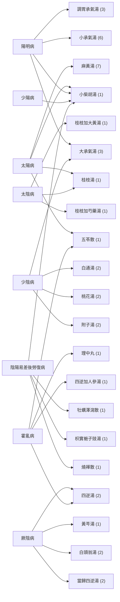

```mermaid
graph LR
  taiyang["太陽病"]
  taiyang --> f7583["桂枝湯 (21)"]
  taiyang --> f6325["小柴胡湯 (13)"]
  taiyang --> f785["麻黃湯 (7)"]
  taiyang --> f1702["五苓散 (6)"]
  yangming["陽明病"]
  yangming --> f9728["大承氣湯 (16)"]
  yangming --> f1984["小承氣湯 (6)"]
  yangming --> f3044["調胃承氣湯 (3)"]
  yangming --> f6325["小柴胡湯 (3)"]
  shaoyang["少陽病"]
  shaoyang --> f6325["小柴胡湯 (2)"]
  taiyin["太陰病"]
  taiyin --> f7583["桂枝湯 (1)"]
  taiyin --> f6894["桂枝加芍藥湯 (1)"]
  taiyin --> f8654["桂枝加大黃湯 (1)"]
  shaoyin["少陰病"]
  shaoyin --> f9728["大承氣湯 (3)"]
  shaoyin --> f9133["附子湯 (2)"]
  shaoyin --> f3822["桃花湯 (2)"]
  shaoyin --> f715["白通湯 (2)"]
  jueyin["厥陰病"]
  jueyin --> f6852["四逆湯 (4)"]
  jueyin --> f1899["當歸四逆湯 (2)"]
  jueyin --> f2261["白頭翁湯 (2)"]
  jueyin --> f2078["黃芩湯 (1)"]
  huoluan["霍亂病"]
  huoluan --> f6852["四逆湯 (2)"]
  huoluan --> f3169["四逆加人參湯 (1)"]
  huoluan --> f501["理中丸 (1)"]
  huoluan --> f1702["五苓散 (1)"]
  laofu["陰陽易差後勞復病"]
  laofu --> f7106["燒褌散 (1)"]
  laofu --> f6913["枳實梔子豉湯 (1)"]
  laofu --> f6325["小柴胡湯 (1)"]
  laofu --> f5234["牡蠣澤瀉散 (1)"]
```