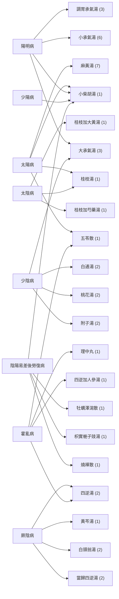

```mermaid
graph LR
  taiyang["太陽病"]
  taiyang --> f1377["桂枝湯 (21)"]
  taiyang --> f107["小柴胡湯 (13)"]
  taiyang --> f9314["麻黃湯 (7)"]
  taiyang --> f3709["五苓散 (6)"]
  yangming["陽明病"]
  yangming --> f7922["大承氣湯 (16)"]
  yangming --> f2159["小承氣湯 (6)"]
  yangming --> f6099["調胃承氣湯 (3)"]
  yangming --> f107["小柴胡湯 (3)"]
  shaoyang["少陽病"]
  shaoyang --> f107["小柴胡湯 (2)"]
  taiyin["太陰病"]
  taiyin --> f1377["桂枝湯 (1)"]
  taiyin --> f2103["桂枝加芍藥湯 (1)"]
  taiyin --> f8357["桂枝加大黃湯 (1)"]
  shaoyin["少陰病"]
  shaoyin --> f7922["大承氣湯 (3)"]
  shaoyin --> f8413["附子湯 (2)"]
  shaoyin --> f9719["桃花湯 (2)"]
  shaoyin --> f2257["白通湯 (2)"]
  jueyin["厥陰病"]
  jueyin --> f2693["四逆湯 (4)"]
  jueyin --> f7474["當歸四逆湯 (2)"]
  jueyin --> f3625["白頭翁湯 (2)"]
  jueyin --> f4737["黃芩湯 (1)"]
  huoluan["霍亂病"]
  huoluan --> f2693["四逆湯 (2)"]
  huoluan --> f3202["四逆加人參湯 (1)"]
  huoluan --> f9696["理中丸 (1)"]
  huoluan --> f3709["五苓散 (1)"]
  laofu["陰陽易差後勞復病"]
  laofu --> f6454["燒褌散 (1)"]
  laofu --> f1380["枳實梔子豉湯 (1)"]
  laofu --> f107["小柴胡湯 (1)"]
  laofu --> f2138["牡蠣澤瀉散 (1)"]
```