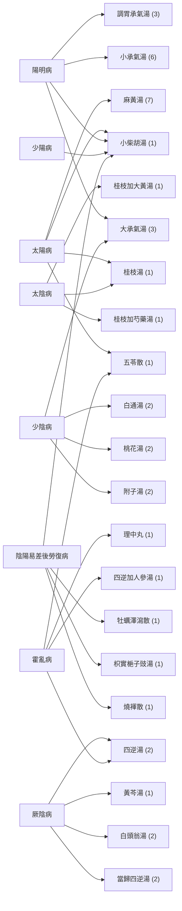

```mermaid
graph LR
  taiyang["太陽病"]
  taiyang --> f5631["桂枝湯 (21)"]
  taiyang --> f9974["小柴胡湯 (13)"]
  taiyang --> f3764["麻黃湯 (7)"]
  taiyang --> f8785["五苓散 (6)"]
  yangming["陽明病"]
  yangming --> f1582["大承氣湯 (16)"]
  yangming --> f7152["小承氣湯 (6)"]
  yangming --> f5018["調胃承氣湯 (3)"]
  yangming --> f9974["小柴胡湯 (3)"]
  shaoyang["少陽病"]
  shaoyang --> f9974["小柴胡湯 (2)"]
  taiyin["太陰病"]
  taiyin --> f5631["桂枝湯 (1)"]
  taiyin --> f9344["桂枝加芍藥湯 (1)"]
  taiyin --> f6721["桂枝加大黃湯 (1)"]
  shaoyin["少陰病"]
  shaoyin --> f1582["大承氣湯 (3)"]
  shaoyin --> f4818["附子湯 (2)"]
  shaoyin --> f5709["桃花湯 (2)"]
  shaoyin --> f3017["白通湯 (2)"]
  jueyin["厥陰病"]
  jueyin --> f5687["四逆湯 (4)"]
  jueyin --> f111["當歸四逆湯 (2)"]
  jueyin --> f2812["白頭翁湯 (2)"]
  jueyin --> f1945["黃芩湯 (1)"]
  huoluan["霍亂病"]
  huoluan --> f5687["四逆湯 (2)"]
  huoluan --> f6650["四逆加人參湯 (1)"]
  huoluan --> f3870["理中丸 (1)"]
  huoluan --> f8785["五苓散 (1)"]
  laofu["陰陽易差後勞復病"]
  laofu --> f1454["燒褌散 (1)"]
  laofu --> f7983["枳實梔子豉湯 (1)"]
  laofu --> f9974["小柴胡湯 (1)"]
  laofu --> f2837["牡蠣澤瀉散 (1)"]
```