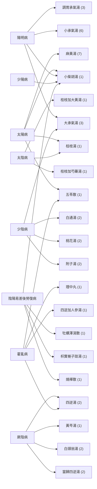

```mermaid
graph LR
  taiyang["太陽病"]
  taiyang --> f4687["桂枝湯 (21)"]
  taiyang --> f6448["小柴胡湯 (13)"]
  taiyang --> f54["麻黃湯 (7)"]
  taiyang --> f5980["五苓散 (6)"]
  yangming["陽明病"]
  yangming --> f8363["大承氣湯 (16)"]
  yangming --> f2246["小承氣湯 (6)"]
  yangming --> f4380["調胃承氣湯 (3)"]
  yangming --> f6448["小柴胡湯 (3)"]
  shaoyang["少陽病"]
  shaoyang --> f6448["小柴胡湯 (2)"]
  taiyin["太陰病"]
  taiyin --> f4687["桂枝湯 (1)"]
  taiyin --> f1380["桂枝加芍藥湯 (1)"]
  taiyin --> f5544["桂枝加大黃湯 (1)"]
  shaoyin["少陰病"]
  shaoyin --> f8363["大承氣湯 (3)"]
  shaoyin --> f4703["附子湯 (2)"]
  shaoyin --> f1943["桃花湯 (2)"]
  shaoyin --> f6172["白通湯 (2)"]
  jueyin["厥陰病"]
  jueyin --> f4497["四逆湯 (4)"]
  jueyin --> f3572["當歸四逆湯 (2)"]
  jueyin --> f2144["白頭翁湯 (2)"]
  jueyin --> f260["黃芩湯 (1)"]
  huoluan["霍亂病"]
  huoluan --> f4497["四逆湯 (2)"]
  huoluan --> f4837["四逆加人參湯 (1)"]
  huoluan --> f7673["理中丸 (1)"]
  huoluan --> f5980["五苓散 (1)"]
  laofu["陰陽易差後勞復病"]
  laofu --> f9783["燒褌散 (1)"]
  laofu --> f9047["枳實梔子豉湯 (1)"]
  laofu --> f6448["小柴胡湯 (1)"]
  laofu --> f7515["牡蠣澤瀉散 (1)"]
```